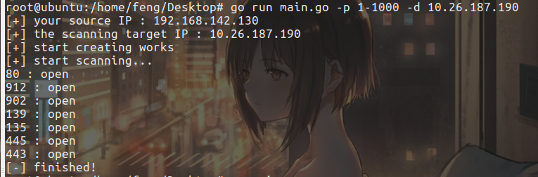
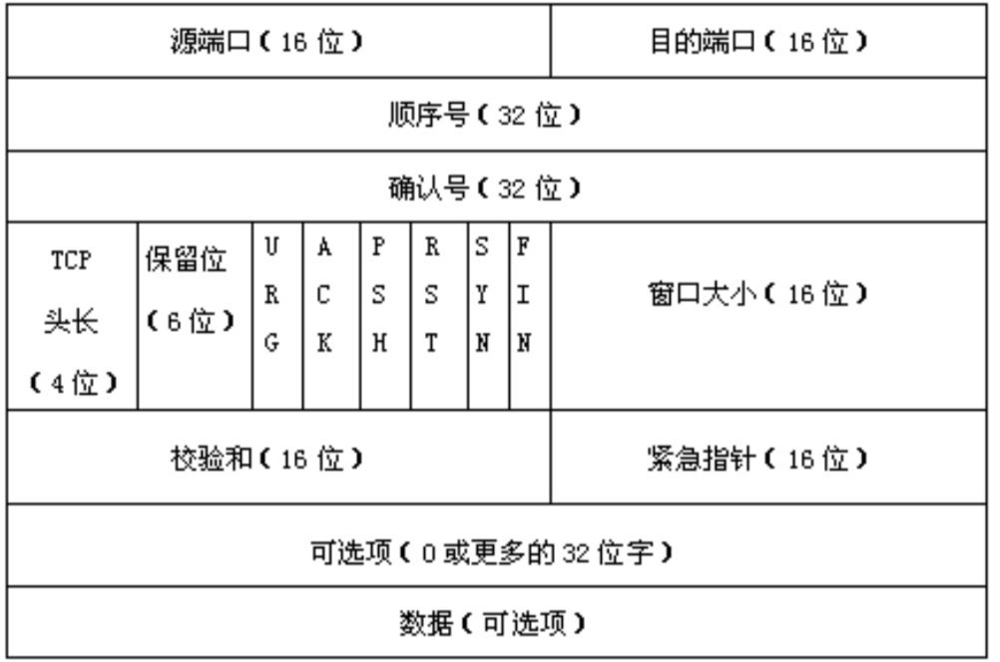

# README

## 介绍

参考lfy学长的portscan做了这么一个端口扫描工具，能够比较稳定且快速的扫描目标ip所开放的端口。

只实现了SYN功能的扫描，因为TCP全扫描效率低且会留下记录所以并没有实现，UDP的速度太慢所以也没有实现，FIN的代码和SYN的实现方式差不多所以也没有实现。（其实就是我懒，我觉得SYN功能的port scanner已经够用了）


## 使用

```shell
root@ubuntu:/home/feng/Desktop# go run main.go -h
  -d string
    	the ip you want to scan
  -h	show the help
  -p string
    	the port you want to scan

```

- d：你想要扫描的ip
- h：帮助
- p：端口，是一个范围，比如1-1024，包括1和1024


示例：



## 原理和实现

nmap中对于SYN扫描是这样说的：

> SYN扫描作为默认的也是最受欢迎的扫描选项，是有充分理由的。 它执行得很快，在一个没有入侵防火墙的快速网络上，每秒钟可以扫描数千个 端口。 SYN扫描相对来说不张扬，不易被注意到，因为它从来不完成TCP连接。 它也不像Fin/Null/Xmas，Maimon和Idle扫描依赖于特定平台，而可以应对任何兼容的 TCP协议栈。 它还可以明确可靠地区分`open`(开放的)， `closed`(关闭的)，和`filtered`(被过滤的) 状态
>
> 它常常被称为半开放扫描， 因为它不打开一个完全的TCP连接。它发送一个SYN报文， 就像您真的要打开一个连接，然后等待响应。 SYN/ACK表示端口在监听 (开放)，而 RST (复位)表示没有监听者。如果数次重发后仍没响应， 该端口就被标记为被过滤。如果收到ICMP不可到达错误 (类型3，代码1，2，3，9，10，或者13)，该端口也被标记为被过滤。

发送SYN报文，根据响应的TCP报文中的flag来判断目标端口是否存在。如果返回的是ACK+SYN则说明端口存在；如果返回的是RST+ACK则说明端口不存在。


Go中进行通信的是net包，但是如果原生TCP报文的话我们无法控制flag，因此需要自己手写运输层的数据包，作为IP层数据包的data部分。

根据TCP头部的构造：



手撕个数据结构：

```go
type TcpHeader struct {
	SourcePort    uint16
	DestPort      uint16
	Seq           uint32
	Ack           uint32
	Flags         uint16
	Window        uint16
	CheckSum      uint16
	UrgentPointer uint16
	optionAndFill uint32
}
```

然后进行赋值即可。

校验和字段需要添加伪首部进行二进制反码求和：

```go
//Tcp报文头部中校验和的计算
func checkSum(header *TcpHeader, task *ScanTask) uint16 {
	//sourceIp = "10.26.187.190"
	sourceIpByte := ipToByteSlice(task.SourceIp)
	destIpByte := ipToByteSlice(task.DestIp)
	pseudoHeader := []byte{
		sourceIpByte[0], sourceIpByte[1], sourceIpByte[2], sourceIpByte[3],
		destIpByte[0], destIpByte[1], destIpByte[2], destIpByte[3],
		0,
		6,
		0,
		24,
	}
	totalHeader := append(pseudoHeader, headerToByteSlice(header)...)
	sum := uint32(0)
	//fmt.Println(len(totalHeader))
	//fmt.Println(totalHeader)
	for i := 0; i < len(totalHeader); i += 2 {
		sum += uint32(uint16(totalHeader[i])<<8 | uint16(totalHeader[i+1]))
		sum = (sum >> 16) + (sum & 0xffff)
		sum += (sum >> 16)
	}
	//如果作为二元运算符是按位异或
	//如果是一元运算符是取反
	return ^uint16(sum)
}
```


在发送数据包之后进行接受，如果收到的是SA说明端口存在，我们再发送一个RST来断开连接，不然会占用服务器的资源（其实可能没太大影响）：

```java
func (task *ScanTask) sendRST() {
	conn, err := net.Dial("ip4:6", task.DestIp)
	checkError(err)
	//flag为R
	tcpHeader := &TcpHeader{
		task.SourcePort,
		task.DestPort,
		rand.Uint32(),
		uint32(0),
		//0110 000000 000100
		uint16(24580),
		uint16(20000),
		uint16(0),
		uint16(0),
		uint32(0),
	}
	tcpHeader.CheckSum = checkSum(tcpHeader, task)
	_, err = conn.Write(headerToByteSlice(tcpHeader))
	checkError(err)
	conn.Close()
	//fmt.Println(5)
}
```


整体的工作流程肯定需要利用go的协程，这里我采用的是协程池来管理，具体细节看代码了。


可能会出现的一些问题就是，本地IP的获取：

```go
//获取本次请求的源ip地址，用于在检验和中计算。
func getSourceIp() (sourceIp string) {
	addrs, err := net.InterfaceAddrs()
	checkError(err)
	for _, address := range addrs {
		// 检查ip地址判断是否回环地址
		if ipnet, ok := address.(*net.IPNet); ok && !ipnet.IP.IsLoopback() {
			if ipnet.IP.To4() != nil {
				//if ipnet.IP.To4() != nil && strings.HasPrefix(ipnet.IP.String(), "10.") {
				sourceIp = ipnet.IP.String()
			}
		}
	}
	//fmt.Println("sourceIp:", sourceIp)
	return
}
```

可能不同的操作系统，不同的环境获取的不一样，可能会获取不到，也有可能获取多条，这个根据环境自行处理了。


在实际测试的过程中，发现相应包丢包还是比较严重的，且目标服务器会进行两轮重传，一般存活端口的报文在这三次传送中都能收到。唯一的问题时间问题，我大概测得是，本地每轮是2s，腾讯云的服务器面对丢包是每20s传1次，就导致了如果有个端口的包丢了2次，在第二次重传才传过来的话，获取它的扫描结果可能需要40多秒，但是也没办法。


因此scanner对于扫描是否结束的判断就是超过30s没有接收到新报文就视为扫描结束或者接收到了全部的报文（不丢包这东西我只在扫很少的端口的时候才出现过），这个值也可以自行调整。

```go
	for !(pool.finishedWorkCount == pool.workerNum) {
		//nowFinishedCount := pool.finishedWorkCount
		nowTime := time.Now().Unix()
		if pool.finishedWorkCount == lastFinishedCount && nowTime-lastTime >= 30 {
			fmt.Println("[-] finished!")
			os.Exit(0)
		} else if pool.finishedWorkCount != lastFinishedCount {
			lastFinishedCount = pool.finishedWorkCount
			lastTime = nowTime
		}
	}
```

在很多的测试中也只有一次出现了存活端口的响应包3次全丢了的情况，后续可能会再实现一下对于未响应端口进行二次探测的功能。


总体思路是这样。


## 参考文章

https://www.anquanke.com/post/id/239641

https://nmap.org/man/zh/man-port-scanning-techniques.html

https://www.ichenxiaoyu.com/raw_socket/